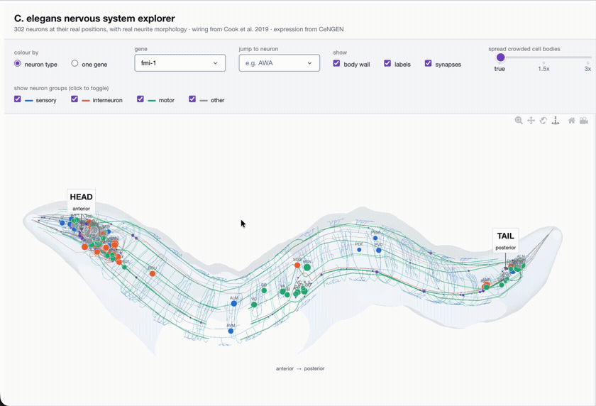
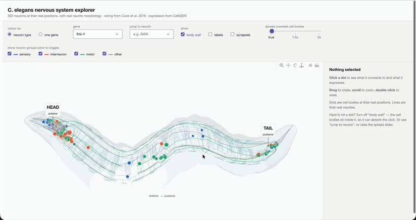

# Wormview

An interactive 3D explorer for the *C. elegans* nervous system.

All 302 neurons at their **real positions inside the animal**, drawn with their
**real neurite morphology**, wired by the connectome, and colourable by the
expression of any of ~13,700 genes. Click a cell body to see what it connects to
and what it expresses.

Three public datasets joined into one browsable picture — no Blender, no Docker.



*Drag to rotate the animal. Every line is a real measured neurite; every dot is a
cell body at its real position.*



*Hover any cell body for its details, or recolour the whole nervous system by any
of 13,669 genes.*

---

## Quick start

```bash
python3 -m venv .venv
.venv/bin/pip install -r requirements.txt

.venv/bin/python fetch_data.py     # once: ~50 MB of public data
.venv/bin/python app.py            # opens http://127.0.0.1:8050
```

Drag to rotate, scroll to zoom, click a cell body to inspect it.

## What you see

| Element | Meaning |
|---|---|
| Thin coloured lines | real neurite morphology — 13,566 measured segments |
| Dots | cell bodies at their real positions; the clickable layer |
| Dot size | number of synaptic connections |
| Colour | sensory / interneuron / motor — or one gene's expression |
| Gold | the selected neuron's own neurites |
| Magenta rings | the selected neuron's synaptic partners — click one to jump to it |
| Violet dots | synapses, placed where the two neurites actually touch |
| Translucent shell | schematic body wall |

**Controls.** Colour by neuron type, or by any single gene — which recolours the
neurites too, not just the cell bodies, so a gene like `mec-7` lights up whole
processes. Jump to a neuron by name. Toggle the body wall, the labels and the
synapses. Show or hide each neuron group. Spread crowded cell bodies apart — which
never moves a neuron *along* the body, only in cross-section.

Turning the **body wall** off makes clicking easier: the cell bodies sit inside it,
so it can absorb a click aimed at one.

**Side panel.** What the neuron sends to and receives from, with synapse counts;
its most strongly expressed genes; and which watch-list genes are on in it.

## Layout

```
app.py               Dash entry point: layout and callbacks
fetch_data.py        downloads all three datasets
fetch_positions.py   parses the 302 NeuroML geometry files
wormview/
  data.py            CeNGEN expression matrices (4 stringency thresholds)
  connectome.py      wiring, and mapping neuron names onto expression classes
  anatomy.py         3D positions, neurite morphology, body wall, declutter
  genes.py           the watch-list of genes highlighted in the panel
  figure.py          the Plotly 3D scene
  panel.py           the side panel
  theme.py           colours and fonts
tests/               77 tests
```

## Data sources

| Data | Source |
|---|---|
| 3D positions & neurite morphology | [`openworm/CElegansNeuroML`](https://github.com/openworm/CElegansNeuroML) — NeuroML from the WormBase Virtual Worm model, 302 neurons |
| Wiring | Cook et al. 2019, *Nature* — whole-animal hermaphrodite connectome, via [`openworm/ConnectomeToolbox`](https://github.com/openworm/ConnectomeToolbox) |
| Gene expression | [CeNGEN](https://www.cengen.org/) (Taylor et al. 2021) — 13,669 genes × 128 neuron classes |

The Cook connectome is used rather than the Witvliet 2021 reconstructions because
Witvliet covers the brain only and contains **no ventral cord motor neurons**.

## Tests

```bash
.venv/bin/python -m pytest tests/ -q
```

They target the places where an error would be silent rather than loud:

- **Neuron-name mapping.** Three datasets name things three ways — NeuroML `DB1`,
  connectome `DB01`, CeNGEN `VD_DD` for a whole merged class. A test asserts that
  **100% of neuron-to-neuron edges map**, because an earlier version quietly
  dropped 44% of the wiring.
- **Morphology parsing.** NeuroML segments inherit their start point from their
  parent, which is easy to get wrong in two different ways — once producing
  zigzags across the animal, once collapsing `AVAL` from 56 segments to 3. Both
  are now regression-tested.
- **Anatomical spot-checks.** `I1` must be at the extreme anterior, `PLM` at the
  extreme posterior, `HSN` mid-body.
- **Figure building** across every option combination, since a `NameError` in a
  Dash callback only appears at runtime in a browser.
- **The interaction settings.** If the canvas is cropped or not responsive, rotate,
  zoom and click all break together.

## Known limits

- **A dot is a neuron *class*, not one cell.** CeNGEN reports classes, so `VD_DD`
  sits at the mean position of all 19 VD and DD neurons, and individual members
  cannot be separated.
- **Cross-section is exaggerated ~2×.** The animal is roughly 13:1 (720 µm long,
  55 µm across); at true proportions it is an unreadable thread. Position *along*
  the body is to scale.
- **The 3D shape is the Virtual Worm model**, which captures the animal in a
  natural curved posture — the S-curve is real, not a bug.
- **Expression is L4 (near-adult)** while wiring is built earlier in development.
- **Chemical synapses only** in the current view; gap junctions are in the data.
- **Synapse positions are estimated.** The connectome gives partner pairs and
  synapse counts, not coordinates, so each synapse is drawn where the two neurons'
  neurites come closest. Median gap 0 µm, 95th percentile 1.5 µm — a good estimate,
  but not a measurement.
- **The body wall is schematic**, fitted to the neurite cloud rather than a real
  outline.
- For secreted proteins CeNGEN's neuron-only sampling means **absence proves
  nothing**; the panel says so for the genes it affects.

## Licence

Code: MIT. The underlying datasets keep their own licences — see the sources above.
